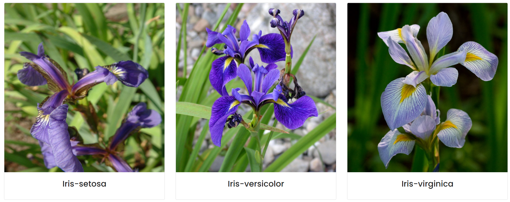

# Iris-Classifcation

## Goals
**Can the data help to classify the correct species of Iris flower?**
The key question we look to answer is whether the sepal and petal properties can provide us with the corrext speices of Iris flower.
Our goal is to eventually provide these insights to correctly classify the flower based on the attributes.

# Contibutors
* Harshit Kumar Jain ([@harshitkumarj](https://github.com/harshitkumarj))
* Mudit Bhandari ([@mudit2000](https://github.com/mudit2000))

# SPECIES

